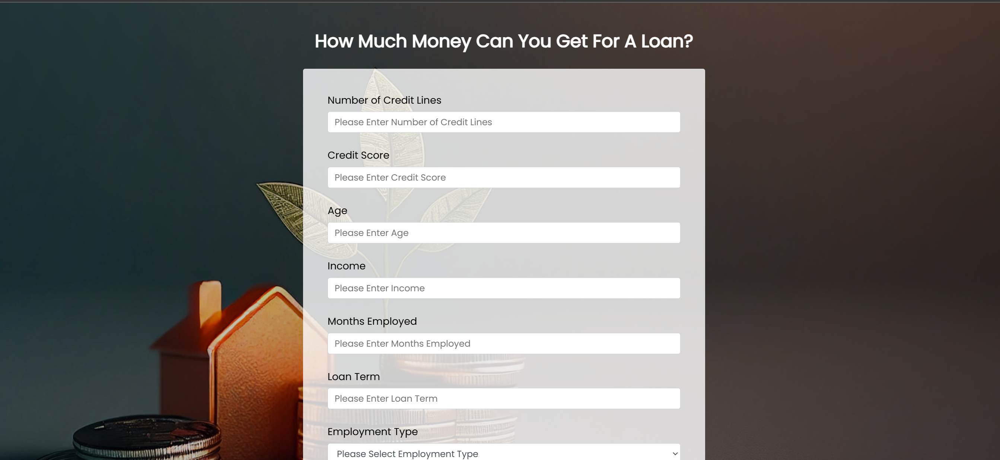
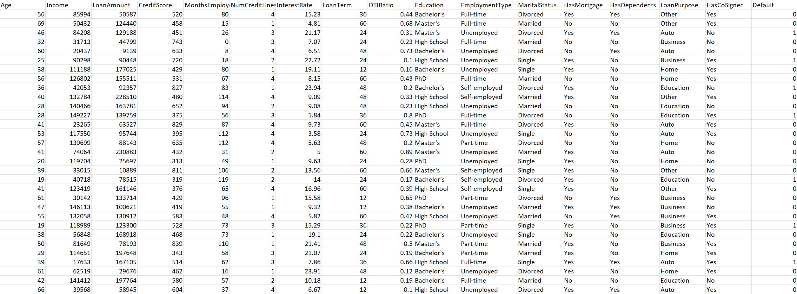
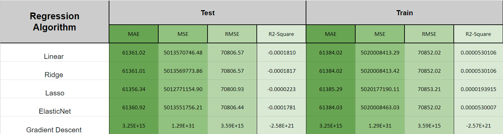

# How Much Can You Get?: Increasing Lead Conversion Rates For Banks Through Loan Calculator

 <a href="https://how-much-can-you-get-749ef1683164.herokuapp.com/" target="_blank">Find Out How Much You Can Get Now!</a>

## Introduction
Banks, like many businesses, struggle when it comes to generating quality leads and converting them. There are many factors that influence these issues. However, a potential solution is having a website powered by an ML model that can predict the maximum amount of loan one can have based on one’s income, employment status, credit score, and other factors. Just having a website like this can increase leads from 3% to 5% (66.7% Increase)<a href="https://www.goodvibesquad.com/blog/how-to-improve-your-mortgage-lead-conversion/#:~:text=What%20is%20the%20average%20mortgage,number%20to%204%2D5%25." target="_blank">(Sy)</a>.

**Concepts Applied:**
- Regression Modeling: Linear, Ridge, Lasso, ElasticNet, Gradient Descent
- Model Deployment: Heroku, Flask, HTML 

**Problem Statement:**
- How to increase customer awareness of our financial products?
- How to provide value to the customer online?
- How to setup an online system to provide value to the customer online?

----
## Data Collection And Cleaning
- Data Collection
  - The dataset used for this project was originally created and posted on Kaggle by NIKHIL. The dataset is a compilation of Financial loan services are leveraged by companies across many industries, from big banks, financial institutions, and government loans. It contains 18 features and 255,347 observations. Some of the features include age, income, loan amount, default and so on. The file of this dataset can be found at: https://www.kaggle.com/datasets/nikhil1e9/loan-default
- Raw Data Snapshot
  
- Data Cleaning
  - Data points are evaluated for correctness, datatypes and overall uniformity
  - Outliers are dropped from the dataset
  - Null values are imputed and dropped when needed

----
## Data Modeling
- Pre-Modeling
  - The LoanAmount class is selected as the target class
  - Non-numeric datatypes are converted to numeric (float)
  - Correlation among the features is evaluated
  - Data is split into 75% and 25% for training and testing, respectively
- Modeling
 - Linear, Ridge, Lasso, ElasticNet, and Gradient Descent algorithms are created
  - Models evaluation
   
  - Results
    - Linear regression  is the best algorithm out of the five. This is gleaned from the table containing the MAE, MSE, RMSE,  R2 Square results. In the table, most algorithms are  similar to one another in terms of performance. The only exception is gradient descent which significantly under performs the other 4. Linear regression is selected because it has better explainability than the other models. Moreover, it is the lightest of the five, making it ideal for web deployment
- Model Deployment
  - HTML Index file is created with a form and graphics UI
  - The ML model is saved as a pickle file
  - ProcFile for Heroku is created and setup
  - Heroku is set to show HTML index and embed ML Model

----
## Conclusion and Recommendations 
- Providing value through a website that can tell you the maximum amount of money you can borrow is a great way to increase brand awareness and trust
- A regression algorithm is the best suited for predicting a person’s highest potential loan amount
- The linear regression algorithm generated in this project is the best algorithm suited to power a loan estimator website. This is because of its small size and slightly better performance across the board. 
- Integrating this site into the existing infrastructure has the potential to increase leads by up to 66.7%

