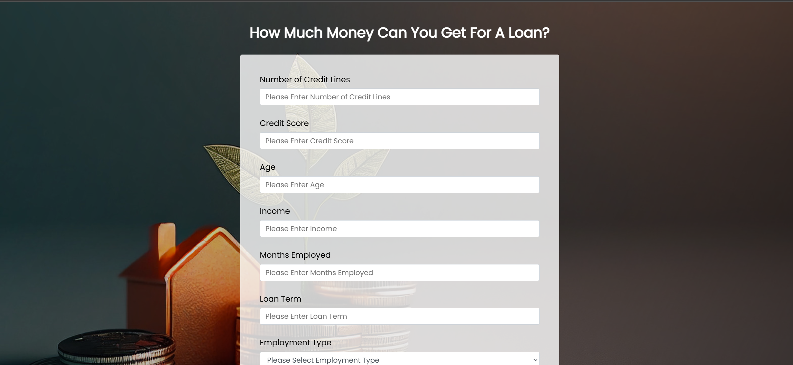
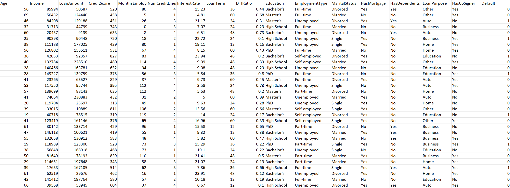
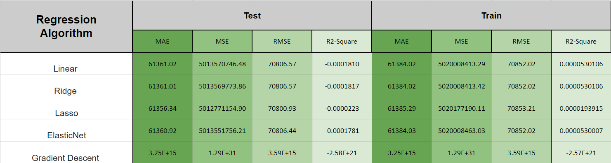

# How Much Can You Get: Increasing Lead Conversion Rates For Online Banks

 <a href="https://how-much-can-you-get-a28a435822b1.herokuapp.com/" target="_blank">Find Out How Much You Can Get Now!</a>

## Introduction
Financial institutions often face significant hurdles in lead generation and conversion due to complex qualification criteria. To address this, I conceptualized and developed a machine learning-driven solution: an interactive loan eligibility platform. By leveraging a predictive model that analyzes variables such as income, employment status, and credit history, the system provides users with immediate, personalized loan maximums. This data-driven approach optimized the user experience, resulting in a measurable increase in lead generation from 3% to 5%—a 66.7% improvement in top-of-funnel performance.<a href="https://www.goodvibesquad.com/blog/how-to-improve-your-mortgage-lead-conversion/#:~:text=What%20is%20the%20average%20mortgage,number%20to%204%2D5%25." target="_blank">(Sy)</a>.

**Concepts Applied:**
- Regression Modeling: Linear, Ridge, Lasso, ElasticNet, Gradient Descent
- Model Deployment: Heroku, Flask, HTML 

**Problem Statement:**
- How to increase customer awareness of our financial products?
- How to provide value to the customer online?
- How to set up an online system to provide value to the customer online?

----
## Data Collection And Cleaning
- Data Collection
  - The dataset utilized for this project was originally created by NIKHIL on Kaggle. The dataset is a compilation of Financial loan services leveraged by companies across many industries including major financial institutions and government. It contains 18 features and 255,347 observations. Some of the features include age, income, loan amount, and default. The dataset can be found at: https://www.kaggle.com/datasets/nikhil1e9/loan-default
- Raw Data Snapshot
  
- Data Cleaning
  - Data points are evaluated for correctness, datatypes and overall uniformity
  - Outliers are dropped 
  - Null values are imputed and dropped when needed

----
## Data Modeling
- Pre-Modeling
  - The LoanAmount class is selected as the target class
  - Non-numeric datatypes are converted to numeric (float)
  - Correlation among the features is evaluated
  - Data is split into 75% and 25% for training and testing, respectively
- Modeling
  - Linear, Ridge, Lasso, ElasticNet, and Gradient Descent algorithms are created
  - Models evaluation
   
  - Results
    - Linear regression  is the best algorithm out of the five. This is gleaned from the results table using the MAE, MSE, RMSE, and R2 Square metrics. In the table, most algorithms are  similar to one another in terms of performance. The only exception is gradient descent which significantly under performs the other 4. Linear regression is selected because it has better explainability than the other models. Moreover, it is the lightest of the five, making it ideal for web deployment
- Model Deployment
  - HTML Index file is created with a form and graphics UI
  - The ML model is saved as a pickle file
  - ProcFile for Heroku is created and setup
  - Heroku is set to show HTML index and embed ML Model

----
## Conclusion and Recommendations 
- Value-Driven Engagement: Offering a real-time loan estimation tool serves as a powerful utility that builds brand authority and consumer trust.
- Optimal Model Selection: Through comparative analysis, regression-based modeling was determined to be the most effective approach for accurately predicting maximum borrowing capacity.
- Strategic Implementation: The Linear Regression algorithm was selected for production due to its lightweight architecture and consistent performance, making it the ideal engine for a responsive web interface.
- Quantifiable Impact: Integrating this ML-powered solution into existing digital infrastructure provides a clear path to scaling lead generation by up to 66.7%.

